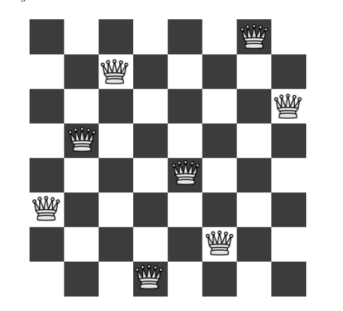
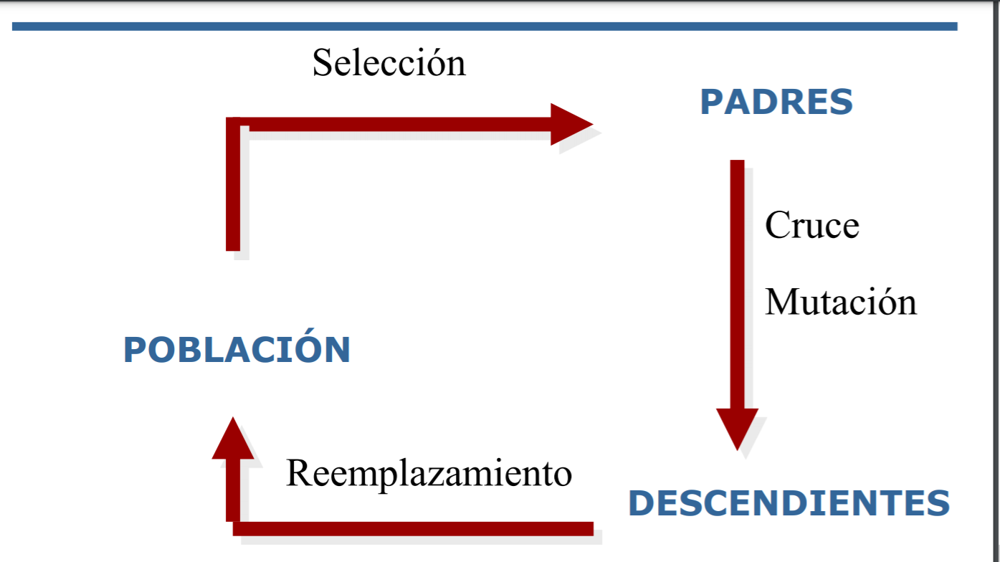

### Proyecto de reinas
En este proyecto se implementa un algoritmo genético que deberia 
resolver el problema de 0 colisiones entre reinas en un tablero
de ajedrez. Este esta dividido por etapas, las cuales describiremos
detalladamente más adelante.

Imagen de las reinas con 0 colisiones.

**Table of Contents**

[TOCM]

[TOC]

#Introducción
Sabemos que los algoritmos genéticos son algoritmos de optimización
búsqueda y aprendizaje
inspirados en los procesos de evolución natural
y evolución genética.
---
 A partir del problema de las cero coliciones de 8 reinas en un
tablero de ajedrez, se implementó un algoritmo
genético con los procesos de generación de población,
selección de padres, cruza, mutación y reemplazamiento
de la población.
----
A continuacion se realizó un proceso de 
50 generaciones para observar la evolución de los 
individuos, así en cada generación se 
escogieron los mejores individuos,
es decir, los que tenian menos coliciones,
para observar la convergencia hacia el individuo ideal
de cero coliciones.

##Proyecto de reinas

## Generación de la población
Para iniciar se comenzó por crear una población de
50 elementos los cuales solo nos representan la posición
de la columna en la que se encuentran cada una
de las reinas, cada individuo esta representado 
como un vector que consta de 8 entradas, 
representadas con números de 0 a 7, sin repetición
las cuales fueron generadas aleatoriamente.

##Seleccion de padres.
Para este algoritmo genético se la selección 
de padres fue por medio de la ponderación de 
aptitud, para ello se obtubo las coliciones
de cada individuo.
----
Una vez obtenidos todos se selecciono el máximo 
para poder obtener la normalización de cada uno
la cual esta dada por, la cantidad de coliciones que 
tiene menos el máximo de todas las coliciones, esto se 
necesita para poder obtener la probabilidad de ser
seleccionado y la probabilidad acomulada.
----
Despues se obtuvieron al azar dos número r1 y r2, 
entre [0,1), para poder seleccionar los padres.

##Cruza
Para este algoritmo se utilizaría el método de cruza
de extremos, el cual consiste en:

-1.Crear una tabla de extremos

-2.Creamos un individuo vacio llamado cruza

-3.Se elige aleatoriamente un extremo que llamamos
curre_element y se le agrega a cruza

-4.Removemos el curre-.element de dotas las listas.

-5.Examinamos la lista que le corresponde a 
curre_element, dentro de este paso se realiza lo 
siguiente.

    -Si existe un elemento que pertenezca a los dos padres 
    seleccionamos a curre_element como ese elemento.
    -De otro modo de selecciona como curre_element
    la entrada con la lista mas pequeña
    -Se selecciona como curre_element un numero 
    aleatorio (3)
    -Terminamos al encontrar un curre_element en 
    una lista vacia y el tamaño del hijo es 8 

##Mutacion.
En esta etapa se utilizó la mutación por inserción
Una inserción es un tipo de mutación que implica 
la adición de material genético. Una mutación 
por inserción puede ser pequeña e involucrar 
un único par de bases de ADN, o grande e 
involucrar un fragmento de un cromosoma.
----
Se mencionara los pasos que se realizaron:

    -1 Seleccionar al azar dos posiciones del hijo
    que vamos a mutar, posición 1 y posición 2.

    -2 Se crea un vector vacío, en cual se le van
    a ir agregando los elementos del hijo a mutar

    -3 Para todos los elementos que esten antes o iguales que
    la posición 1 se agregan a al cevtor vacío.
    
    -4 Al vector vacío se le agrega el elemento de
    posición 2

    -5 Si existen elementos entre posición 1 y posición 2
    se agragan

    -6 Por último se agregan los elemenos que estan despues
    de posición 2.

## Remplazamiento
Para el remplazamiento se útilizo el método 
de Elitismo, se creo una nueva población que 
constaba de 52 elementos, después se ordenaron
de menor a mayor  de acuerdo a las colisiones que tuviera 
cada elemento de la nueva población.
---
Una vez ordenados de forma creciente, solo se seleccionan
los primeros 50 elementos , dejando así los peores elementos
de la nueva población.
---------------
Al estar realizando este reemplazamiento, nos garantiza
que la convergencia al individuo ideal sea más rapido, 
ya que siempre nos quedamos con solos los individuos que 
tienen menor colisiones.
